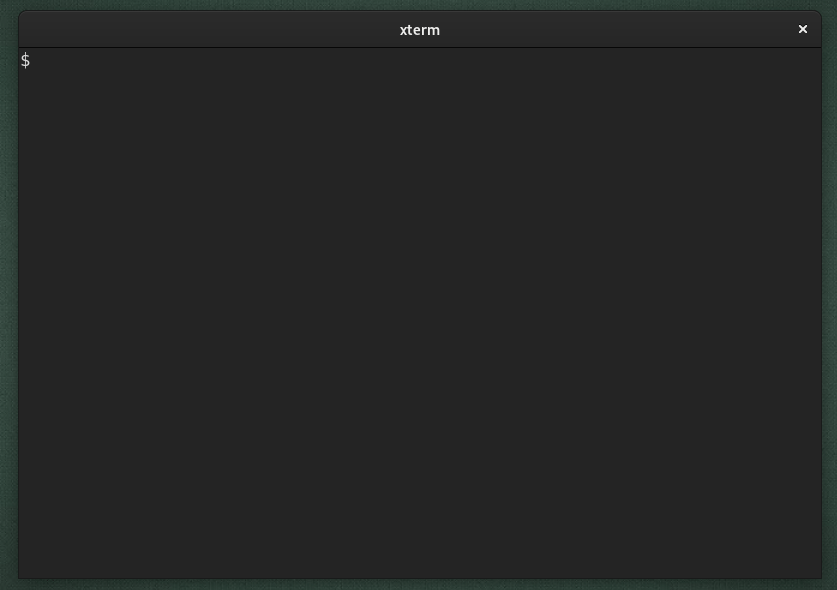

# `pomo`

## Motivation

While following the [Learning How To Learn][1] on Coursera, the instructors
recommended the [Pomodoro Technique][2] to help overcome procrastination and
allow the brain to enter the "diffuse mode" of thinking, which is essential for
learning and problem-solving.

I wanted a simple pomodoro timer which would integrate well with the terminal,
as I got tired of setting alarms on my phone/desktop, and would often forget to
set them at all.

## Goals

1. As simple as possible
1. Minimal dependencies
1. Doesn't rely on a particular shell syntax (thus POSIX syntax)
1. Doesn't rely on a particular desktop environment or Linux distribution
   (Ideally will also work on OS X)
1. Runs independently of the parent process (so if the terminal window is
   closed, the timer still runs, and is still able to alert the user)

## TODO:

- [ ] OS X testing (Terminal and iTerm2)

## Example usage:



## Install

Should work fine in any POSIX compliant shell.

```shell
# `foo` is a directory in your `$PATH`
cd foo

# Download the raw script file
curl -so ./pomo https://raw.githubusercontent.com/jaf7C7/pomo/master/pomo 

# Make the script executable
chmod +x pomo
```

Or alternatively if you want the entire repo:

```shell
# Clone the repository
git clone https://github.com/jaf7C7/pomo

# Enter the repository
cd pomo

# Make the script executable
chmod +x pomo

# Create a symlink to the executable in a directory `foo` in your `$PATH`
ln -s pomo foo/pomo

```

[1]: https://www.coursera.org/learn/learning-how-to-learn/home/welcome
[2]: https://en.wikipedia.org/wiki/Pomodoro_Technique
